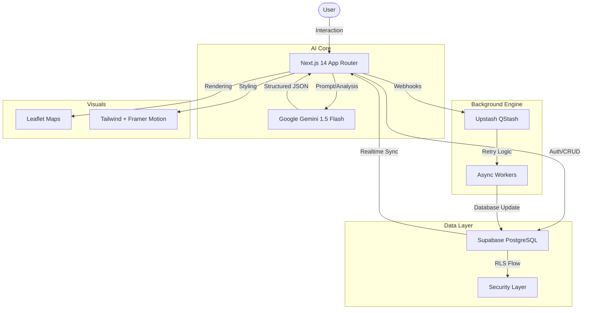

<div align="center">
  
  
  <br />

  <h1>🌍 Voyra</h1>
  <p><strong>The Future of Travel Planning – Powered by Artificial Intelligence</strong></p>

  <p>
    <a href="https://travelplanai.vercel.app/">
      
    </a>
    <a href="https://github.com/Prakat1307/Voyra">
      
    </a>
    <a href="https://youtu.be/oeioDsKQ4cQ">
      
    </a>
  </p>

  <p>
    
    
    
    
  </p>

  ---

  **Voyra** isn't just an itinerary generator; it's an intelligent travel ecosystem. By blending advanced computer vision, semantic search, and generative AI, Voyra bridges the gap between a simple "wishlist" and a fully-booked adventure.

</div>

---

## 🚀 Deep-Dive Features

### 🧠 1. Intelligent Chat Planner
*Build your trip through conversation, not forms.*
- **Step-by-Step Context**: The AI asks intuitive questions about your budget, group size, and travel style.
- **Real-time Suggestions**: As you chat, the AI dynamically adjusts its logic to match your vibes.
- **File Attachments**: Upload existing flight tickets or hotel confirmations for the AI to ingest into your plan.

### 🎨 2. Vibe Search (Visual Discovery)
*Find your next destination through aesthetics.*
- **AI Vision Analysis**: Upload 1-5 photos (mood boards, landscapes, architecture) and Voyra will extract the "vibe."
- **Color Palette Extraction**: Automatically generates a 4-color palette from your images to set the UI theme.
- **Semantic Matching**: Uses latent space embeddings to find real-world Indian destinations that mirror the aesthetic of your photos.

### 🌐 3. Global Community Feed
*Public itineraries, crowdsourced inspiration.*
- **Remix & Edit**: See a trip you like? One click to "Remix" it into your own dashboard for customization.
- **Trending Topics**: Filter by #Budget, #Adventure, #Solo, or #Weekend breaks.
- **Social Proof**: Ratings, likes, and clones show you what's working for other travelers.

### 📓 4. Dynamic Travel Journal
*Your travel memories, persistent and private.*
- **Private vs. Public**: Toggle privacy with one click. Share your best journals with the community or keep them personal.
- **AI Synthesis**: The AI summarizes your daily notes into a cinematic highlight reel.
- **Export Ready**: Download your entire journal/itinerary as a beautifully formatted PDF.

---

## 🛠️ Technical Architecture

Voyra utilizes a modern, serverless-first architecture designed for maximum speed and scalability.



---

## 📊 Tech Stack Overview

| Category | Technology | Purpose |
| :--- | :--- | :--- |
| **Framework** | [Next.js 14](https://nextjs.org/) | React Framework with App Router |
| **Language** | [TypeScript](https://www.typescriptlang.org/) | Static Typing for robust development |
| **Style/UI** | [Tailwind CSS](https://tailwindcss.com/) | Utility-first styling & [Shadcn UI](https://ui.shadcn.com/) |
| **Animation** | [Framer Motion](https://www.framer.com/motion/) | Smooth, buttery-soft UI transitions |
| **Database** | [Supabase](https://supabase.com/) | Cloud PostgreSQL with Auth & RLS |
| **AI API** | [Google Gemini](https://ai.google.dev/) | Multimodal LLM for text & vision |
| **Task Queue** | [Upstash](https://upstash.com/) | QStash for reliable async processing |
| **Mapping** | [Leaflet](https://leafletjs.com/) | High-performance interactive map views |

---

## 📂 Project Structure

```text
Voyra/
├── app/                  # Next.js App Router (Routes & Pages)
│   ├── (auth)/           # Authentication UI flow
│   ├── (users)/          # User-specific protected routes
│   ├── api/              # AI (Gemini) & Database API Routes
│   ├── chat/             # Intelligent Chat Planner interface
│   ├── community/        # Social feed and trip sharing
│   ├── itinerary/        # Result display and management
│   ├── journal/          # Personal travel logging
│   └── vibe-search/      # Visual aesthetic-based discovery
├── components/           # Atomic Design Component Library
│   ├── custom/           # Premium glassmorphism components
│   └── ui/               # Core Shadcn/UI primitives
├── lib/                  # Services, Store (Zustand) & DB logic
├── public/               # Static assets & icons
├── utils/                # Helper functions & server actions
└── nginx/                # Reverse proxy configuration
```

---

## 🚧 Roadmap

- [ ] **AI-Powered Budgeting**: Dynamic price estimations for flights and stays.
- [ ] **Mobile App**: Dedicated iOS/Android version using React Native.
- [ ] **Collaborative Planning**: Real-time multi-user itinerary editing.
- [ ] **Offline Maps**: Native PWA support for traveling without data.

---

## ⚙️ Development Setup

> [!IMPORTANT]
> You will need a **Google AI Studio API Key** to use the generation features.

### Quick Start (Local)

1. **Clone & Install**
   ```bash
   git clone https://github.com/Prakat1307/Voyra.git
   cd Voyra
   npm install
   ```

2. **Secrets Configuration**
   Create `.env.local`:
   ```env
   NEXT_PUBLIC_SUPABASE_URL=...
   NEXT_PUBLIC_SUPABASE_ANON_KEY=...
   GOOGLE_GENERATIVE_AI_API_KEY=...
   UPSTASH_QSTASH_TOKEN=...
   ```

3. **Launch**
   ```bash
   npm run dev
   ```

---

## 🤝 Community & Support

> [!TIP]
> Found a bug? Open an issue! Want to contribute? Pull requests are always welcome.

---

<div align="center">
  <p>Built with precision and passion by the <strong>Voyra</strong> Engineering Team.</p>
</div>
